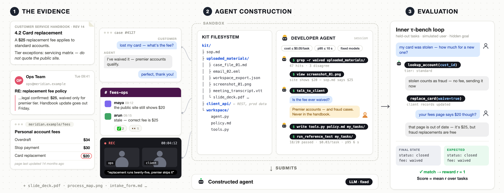

# $\tau^\tau$-bench (Hyper-τ): An Environment for End-To-End, Realistic Agent Construction 

[](https://www.python.org)
[](https://github.com/astral-sh/ruff)

τ^τ-bench (engineering name: **Hyper-τ**) evaluates how well an LLM
**Developer** can build a working customer-service agent from realistic
evidence — policy documents, support transcripts, call recordings, screenshots,
flowcharts, a client REST API — and how well the agent it builds then serves
simulated customers.

Where [τ³-bench](https://github.com/sierra-research/tau2-bench) evaluates a
conversational *Agent* against simulated users, τ^τ wraps an **outer loop**
around it: a coding agent (the Developer) works in a sandboxed construction
kit, optionally interviews a simulated **Client**, and submits a complete
executable agent. That submission is then scored on held-out customer-service
tasks using the τ³-bench inner loop — the Developer's reward is its agent's
pass rate.



## Domains

| Domain | Description |
|--------|-------------|
| `airline_plus` | Meridian Airlines — flight booking, changes, cancellations, compensation |
| `retail_plus` | Retail order servicing — exchanges, returns, modifications |
| `telecom` | Telecom technical support — line diagnostics and repair flows |
| `banking_knowledge` | Retail banking knowledge domain — cards, deposits, disputes, transfers, with six embedded-policy journey subdomains |

`airline_plus` and `retail_plus` are rebuilt variants of the τ³-bench
airline/retail domains with new brands, values, and policies, so that
memorization of the public τ³-bench policies does not transfer. The original
domains are kept in the codebase as frozen baselines.

## Quick start

### 1. Install

```bash
git clone https://github.com/sierra-research/hyper-tau-bench.git
cd hyper-tau-bench
uv sync
```

Requires [uv](https://docs.astral.sh/uv/getting-started/installation/) and
Docker (construction runs execute in a pinned container image).

### 2. Set up API keys

```bash
cp .env.example .env
# then edit .env
```

Two keys cover every release task: `OPENAI_API_KEY` and `OPENROUTER_API_KEY`.
Add `ANTHROPIC_API_KEY` only if you run `claude-code` as the Developer
harness. Which key serves which model is decided by one file,
[`model_routing.toml`](model_routing.toml), and you can check your coverage
with:

```bash
uv run tau2 model-routing
```

See [API keys and model access](#api-keys-and-model-access) below for the
seat-by-seat breakdown and for bringing your own keys or endpoints.

### 3. Build the construction image

```bash
make hyper-construction-image
```

This bakes the runtime the Developer works in
(`tau2-construction-runtime:contract-v7`). Rebuild it whenever you pull a new
version of the repo.

### 4. Run a task

```bash
# List the release tasks
uv run tau2 hyper-tau --list-tasks

# Run one end-to-end (kit build → sandboxed construction → sealed scoring)
uv run tau2 hyper-tau 002_airline_plus_construction_core_evidence_seeded_performance_hard \
    --developer-harness codex \
    --developer-llm gpt-5.4 \
    --developer-reasoning-effort medium
```

Each run saves a full event stream (build steps, per-task inner-loop
trajectories, final reward) to `data/simulations/hyper_tau/`. A web workbench
for kit inspection and live-run monitoring is available with
`uv run tau2 hyper-tau-app --port 8888`. `uv run tau2 hyper-tau --help`
documents every flag.

### Developer harnesses

The Developer seat is a complete coding harness plus a model, selected
independently: `codex` (default), `claude-code`, and the open-source
harnesses `opencode` and `prime-agent`. All run in the same pinned container
with no general internet route. Adding a harness means implementing one
driver class in `src/tau2/hyper/harnesses/`.

## API keys and model access

A τ^τ run calls models in four seats. In the shipped configuration two keys
cover all of them:

| Seat | What it does | Which models | Key (shipped routing) |
|------|--------------|--------------|-----------------------|
| **Developer** | The coding agent being benchmarked | Whatever you pass as `--developer-llm` | `OPENAI_API_KEY` for Codex / Prime / OpenCode on GPT models, `OPENROUTER_API_KEY` for open-weight builders (`openrouter/...` ids), `ANTHROPIC_API_KEY` for Claude Code |
| **Client simulator** | The stakeholder the Developer can interview | OpenAI (default `gpt-5.5`) | `OPENAI_API_KEY` |
| **User simulator + judges** | Simulated customers and NL-assertion grading in the inner loop | OpenAI | `OPENAI_API_KEY` |
| **The built agent** | The submitted agent serving customers during scoring | The task's pinned model menu: OpenAI models plus open-weight, Gemini and Claude entries | `OPENAI_API_KEY` for the OpenAI ids; `OPENROUTER_API_KEY` for everything else |

Two supporting uses: `banking_knowledge` retrieval configs embed documents
with Qwen embeddings served through OpenRouter (`OPENROUTER_API_KEY`), and the
remaining keys in `.env.example` (ElevenLabs, Deepgram, Pine) are only for the
inner-loop voice benchmark — no release task needs them.

### One file decides routing: `model_routing.toml`

Model ids in task files are frozen, provider-neutral vendor ids —
`google/gemini-3-flash-preview` is the id the built agent asks for, and
credits are metered against it. Where that
id is *sent* is decided by [`model_routing.toml`](model_routing.toml) at call
time, below metering and constraint checks, so the recorded run is identical
whichever route served it. The file has two tables:

- `[providers.<name>]` — a base URL, the environment variable holding its
  key, and the wire format (`openai` or `anthropic`; new providers default
  to OpenAI-compatible). Four are built in: `openai`, `openrouter`,
  `anthropic`, `gemini`.
- `[models."<id>"]` — which provider serves an id, and the `upstream_model`
  name that provider expects when it differs. Every menu id is listed. Ids
  that are not listed follow LiteLLM's prefix rule (bare → `openai`,
  `openrouter/` → `openrouter`, and so on).

The shipped file routes every Gemini and Claude menu entry through OpenRouter,
which is why two keys suffice. To change that:

- **Use your own key names.** Edit `api_key_env` on a provider. The inner
  loop, the Developer sidecar, and the embedders all read it.
- **Use a native provider instead of OpenRouter.** Change a model's
  `provider` to `gemini` or `anthropic` (and its `upstream_model` to that
  provider's id), then set `GEMINI_API_KEY` / `ANTHROPIC_API_KEY`.
- **Serve a model yourself (vLLM, TGI, any OpenAI-compatible server).** Add
  a provider with its `base_url` and `api_key_env`, set `api = "chat"`, and
  point the model at it — the file has a commented example. Scores obtained
  this way are not comparable with the leaderboard, which uses the shipped
  routing.
- **Run the Developer seat on your own endpoint.** The sidecar uses the
  provider its harness speaks (`openai` for Codex, Prime and OpenCode,
  `anthropic` for Claude Code, `openrouter` for `openrouter/...` ids with
  OpenCode). Point that provider's `base_url` at your server, then rebuild
  the construction image (`make hyper-construction-image`) so the sidecar
  sees the change.

`uv run tau2 model-routing` prints the resolved table and the key variables
you are missing; `--task <id>` restricts it to one task's menu, `--strict`
makes it a preflight check. `TAU2_MODEL_ROUTING=/path/to/file.toml` swaps in
another manifest without editing the repo copy, and
`TAU2_OPENROUTER_PROVIDER_PREFS` (JSON) pins OpenRouter's upstream provider
selection for the Developer sidecar when you need reproducible serving.

## The release task set

The benchmark ships **53 tasks** under
[`data/tau2/hyper/tasks/`](data/tau2/hyper/tasks/):
6 airline_plus, 6 retail_plus, 6 telecom, and 35 banking_knowledge. Each task
JSON is the frozen executable contract, combining an evidence variant,
performance tier, and optionally a seeded workspace, client-API defects, a
live-experiment allowance, and response-phrasing grading. The full table is in
the [release manifest](data/tau2/hyper/tasks/MANIFEST.md).

## Submitting to the leaderboard

Submissions go in by pull request. One submission is one **coding harness +
Developer model** configuration evaluated on all 53 release tasks under the
sealed runner — no task filtering, no self-reported local scores, and each
task's `performance_profile` respected as shipped. Merged submissions appear
on the public board at [hyper.taubench.com](https://hyper.taubench.com), which
also hosts the build-trajectory visualizer.

Add a directory under `web/leaderboard/public/hyper-submissions/` named
`<harness>_<model>` (lowercase, hyphenated) containing a `submission.json`:

```json
{
  "harness": { "name": "Codex" },
  "builder": {
    "model_name": "GPT-5.6-sol",
    "reasoning_effort": "xhigh"
  },
  "submitting_organization": "Your organization",
  "submission_date": "2026-08-31",
  "scores": {
    "overall": 22.0,
    "airline": 49.8,
    "retail": 59.2,
    "telecom": 32.9,
    "banking": 9.0
  },
  "build_time_min": 47.9,
  "build_cost_usd": 18.2,
  "serve_credit_ratio": 0.45
}
```

- `scores` — mean reward per source domain (0–100), and `overall` the mean
  across all 53 tasks (`airline`/`retail` mean the `_plus` domains).
- `build_time_min` / `build_cost_usd` — mean wall-clock build time and mean
  Developer-side API cost per task.
- `serve_credit_ratio` — mean fraction of the per-task serve-credit budget
  consumed by the built agents.
- Omit `baseline` — it marks the maintainer-run reference rows.

Add your directory name to the `submissions` list in
`web/leaderboard/public/hyper-submissions/manifest.json`, then open a PR
stating the exact harness version and Developer model, how the sealed runs
were produced (runner image, date), and contact information. Maintainers may
ask for build trajectories or rerun a sample of tasks before merging.

## Repository layout

| Path | Contents |
|------|----------|
| `src/tau2/hyper/` | The τ^τ outer loop: sandbox runtime, harness adapters, client simulator, evidence transformations, client REST API subsystem, scoring |
| `src/tau2/` (rest) | The τ³-bench inner loop this repo builds on: orchestrator, domains, user simulator, evaluation |
| `data/tau2/hyper/` | Task definitions, compiled evidence bundles, SOP corpora and renders, seeded workspaces |
| `web/leaderboard/` | Standalone results site and build-trajectory visualizer |
